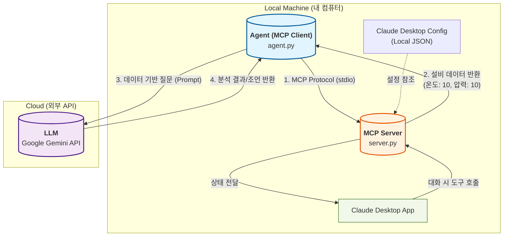

# MCP 시스템 구조도 (Architecture Diagram)

구성 요소와 데이터 흐름을 시각화한 구조도입니다.

## 구성 요소 설명

1.  **MCP Server (`server.py`)**: 
    *   **역할**: 실제 설비 데이터(온도, 압력 등)를 제공하는 **데이터 공급자**입니다. 
    *   **특징**: `stdio`(표준 입출력)를 통해 외부와 통신하며, AI가 호출할 수 있는 '도구(Tool)'를 제공합니다.

2.  **Agent (`agent.py`)**: 
    *   **역할**: 전체 과정을 제어하는 **오케스트레이터(MCP Client)**입니다.
    *   **흐름**: MCP 서버에서 데이터를 가져온 후, 이를 LLM(Gemini)에게 전달하여 최종 분석 결과를 받아냅니다.

3.  **LLM (Gemini API)**: 
    *   **역할**: 전달받은 데이터를 해석하고 조언을 제공하는 **지능형 분석기**입니다.

4.  **Claude Desktop**: 
    *   **역할**: 사용자가 직접 대화하며 MCP 서버의 기능을 사용할 수 있는 **UI 클라이언트**입니다.
