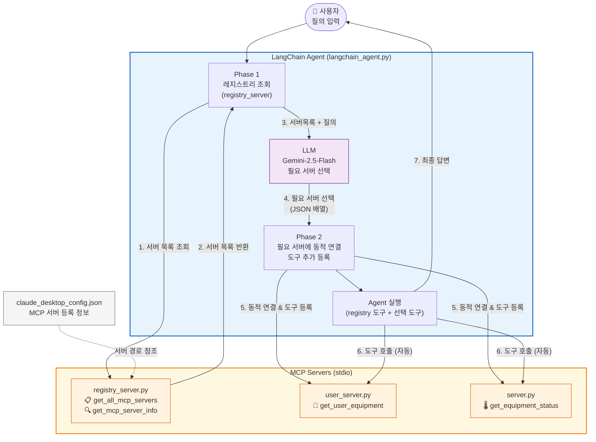

# 시스템 요약 & 구조도

## 📁 구성 파일

| 파일 | 역할 | 제공 도구 |
|---|---|---|
| `server.py` | 설비 상태 MCP 서버 | `get_equipment_status` |
| `user_server.py` | 사용자별 설비 목록 MCP 서버 | `get_user_equipment` |
| `registry_server.py` | MCP 서버 레지스트리 | `get_all_mcp_servers`, `get_mcp_server_info` |
| `langchain_agent.py` | LangChain/LangGraph 에이전트 | - |

---

## 🗺️ 아키텍처 구조도

---

## 🔄 동작 흐름 요약

1. **질의 입력** → 에이전트 시작
2. **Phase 1** → `registry_server`에 연결, 등록된 MCP 서버 전체 목록 획득
3. **서버 선택** → LLM에 질의 + 서버 목록 전달, 필요한 서버를 JSON으로 응답 받음
4. **Phase 2** → 선택된 서버에 동적 연결, 도구 자동 등록 (stdio 기반)
5. **에이전트 실행** → 전체 도구(registry + 동적 추가)로 최종 질의 처리
6. **최종 응답** 출력
